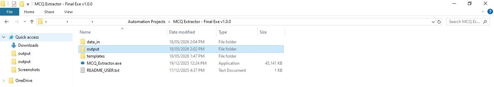
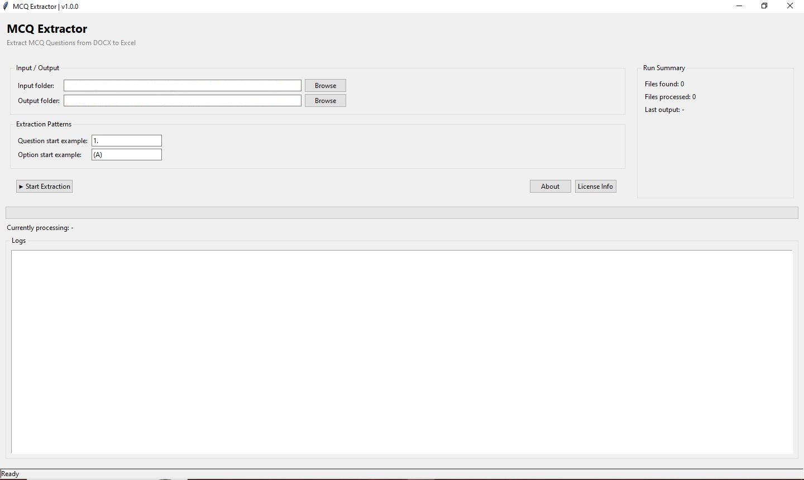
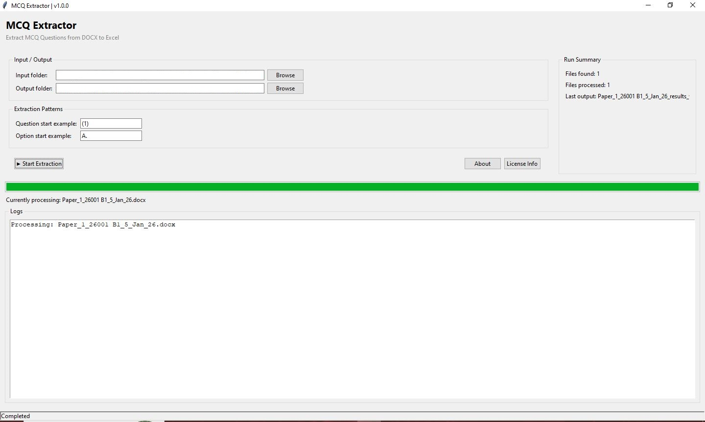
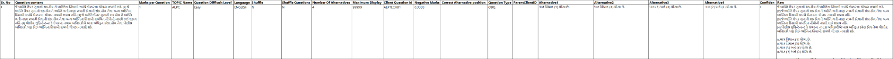

# MCQ Document Processing Automation Tool

## Overview
A Python desktop application designed to automate extraction and structured processing of MCQ-based document content into organized Excel outputs.

This project demonstrates software design for document parsing, automation workflows, batch processing, and structured reporting.

The public repository is a professional portfolio showcase version of a production-style application.

---

## Business Problem
Manual extraction of MCQ content from formatted document files can be time-consuming, repetitive, and prone to formatting inconsistencies.

Common challenges include:

- extracting questions from structured documents
- parsing answer options
- handling formatting variations
- organizing extracted data
- exporting structured outputs
- processing multiple files efficiently

Manual execution increases effort and reduces consistency.

---

## Solution Approach
This desktop automation application provides a structured workflow:

Document Input  
↓  
Pattern Recognition  
↓  
Question Parsing  
↓  
Option Extraction  
↓  
Data Structuring  
↓  
Excel Output Generation

---

## Key Features
- Desktop GUI application
- automated MCQ extraction
- document parsing workflow
- structured Excel export
- configurable extraction patterns
- batch file processing
- operational automation workflow

---

## Tech Stack
- Python
- Tkinter
- Pandas
- OpenPyXL
- Document Processing
- Excel Automation
- Desktop Application Development

---
## Project Screenshots

### Project Structure

### Application Home Screen

### Processing Workflow

### Structured Excel Output

## Portfolio Note
This repository is a public showcase version created for professional portfolio purposes.

Production implementation, proprietary parsing logic, licensing systems, and internal operational code are intentionally excluded.

---

## Author
Kashyap Trivedi

LinkedIn:
https://www.linkedin.com/in/kashyaptrivedii
